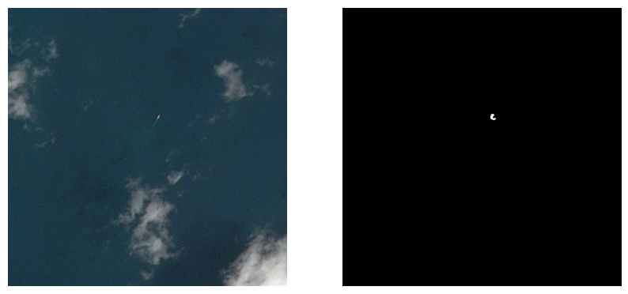

# airbus_ship_detection
Detecting ships in satellite's photos 

## Model performance

FULL VERSION IN OPEN_ME.ipynb !!!

The average Dice Score for this model equals to 0.701, although, only 2% of dataset was used.  
In OPEN_ME.ipynb or in segmentation_masks folder you can see how model performs in complex and unusual situations (detecting big and small ships, with and without clouds, near land and in the open sea).

For example, detection of a ship among clouds.

## Model architecture

The classic Unet architecture was used to solve the task of segmentation ships. The code of my model architecture is located in source/train_model.py in build_model function. The loss function used was a combination of Dice loss and binary cross-entropy.

## Files' description

1) OPEN_ME.ipynb shows model's Dice Score and a few photos for which model predicted binary masks. 
2) source/dataset_creator.py is used to create catalog system, copy images and extract masks from csv for model training and evaluation.
3) source/train_model.py is used to train model.
4) source/predict_model.py is used to automaticly predict binary masks for all images in specific folder, show them if necessary, save them to another specific folder.
5) model_weights is a folder with splitted (because of its size) model weights archive.
6) requirments.txt is a list od necessary libraries.
7) segmentation_masks is a folder with prediction results for images with ships in different situations.

## How to run

1) Download all archives from model_weights folder, and unarchive the ALL AT ONCE
2) Download train_model.py, predict.py from source and put them into the same folder
3) Open predict.py
4) In main function move to "Enter your values here" section.
5) Change all file paths to your own. Here is the discription of all the files' pathes:
 - save_weights_path is a path to the weights. Model weights' name is "my_model", so put it in the end of the path.
 - to_predict_data_path is a path to data you want to predict.
 - save_results_path is a path to the folder, where you want to save the results. Could be None if you don't want to save them.
 - show_results is a bool variable, which indicates whether to show the result. It shows original image and binary mask in the same picture.
5) Run the program 
